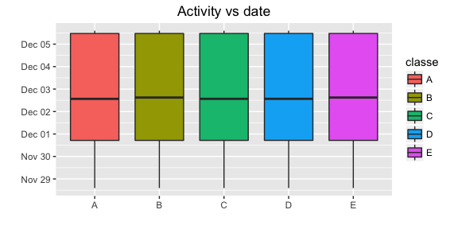

# Prediction of daily activities using sensors
Alexandre Nanchen  
26 March 2016  


# Introduction
The goal of this project is to predict the activities (sitting-down, standing-up, standing, walking, and sitting) of 6 participants based on 
the data from accelerometers placed on the belt, forearm, arm, and dumbell.

The data for this project comes from the following source: [Groupware@LES](http://groupware.les.inf.puc-rio.br/har).

# Data preparation
First we load the data and remove unnecessary variables.


```r
#Load data
dftrainRaw <- tbl_df(read.csv("pml-training.csv"))
dftest <- tbl_df(read.csv("pml-testing.csv"))

#Remove some unnecessary variables
dftest <- dplyr::select(dftest, -one_of(c("X","problem_id","raw_timestamp_part_1", "num_window",
                                          "raw_timestamp_part_2", "cvtd_timestamp")))
zeroVarIndices <- which(nearZeroVar(dftest, saveMetrics = T)["zeroVar"]==TRUE)
dftest <- dplyr::select(dftest,-zeroVarIndices)

#Now prepare training set to match test set
dftrainDev <- dplyr::select(dftrainRaw, one_of(c("classe",names(dftest))))
```

Then data is partitioned into training and development set with a factor of 3/1.  


Using **14718** observations for training and **4904** observations for development.

# Exploratory data analysis
First we check if the 5 different activities are well distributed over time. Looking at the plot in *<a href="#Appendix1">Appendix 1</a>*,
it seems to be the case.

Using unsupervised clustering with k-means shows that the 5 activities cannot be groups by proximity into 5 centroids. See *<a href="#Appendix2">Appendix 2</a>*.


# Prediction models
We will fit three models for comparison: a linear model, a random forest model and a stochastic gradient boosting model.

Looking at the scales of the selected variables, we observe that they differ. Hence, in the three models, variables will be
standardized (centering and scaling).


#### Linear model
Some variables are highly correlated: correlation > 0.9, we remove them.

```r
c <- cor(dftrain[,-c(1,2)])
diag(c) <- 0
corCol <- row.names(which(abs(c) > 0.9,arr.ind = T))

dftrainSelected <- dplyr::select(dftrain, -one_of(corCol))
dfdevSelected <- dplyr::select(dfdev, -one_of(corCol))
```

Then we train a linear model.

```r
#First get the mean and standard deviation for predictors
preObj <- preProcess(dftrainSelected[,-c(1,2)], method=c("center", "scale"))

#Add a numeric factor
map <- c("A"=1,"B"=2,"C"=3,"D"=4, "E"=5)
dftrainSelected$classe2 <- map[dftrainSelected$classe]
dfdevSelected$classe2 <- map[dfdevSelected$classe]

#Train the models
modelFitLinear <- lm(classe2~., data<-predict(preObj,dftrainSelected[,-c(1,2)]))
predLinear <- predict(modelFitLinear, newdata = predict(preObj,dfdevSelected[,-c(1,2)]))
```
A linear model produce an accuracy of **37.72**%.

#### Random forest model
For the random forest model, we will work with all variables. This is because a random selection of variables is done at each split.

Based on the trace output of the Out Of Bag estimate (OOB), we have selected a value of **27** for the number of variables randomly sampled as candidates at each split and a maximum number of trees in the forest of **100**. 

We then train using 5-folds cross validation method to get a first estimate of the out of sample performances.

Finally the development set is used to assess out of sample performances.


```r
set.seed(2345)
dftrainSelected$classe2 <- NULL; dfdevSelected$classe2 <- NULL

mtryGrid <- expand.grid(mtry = 27)
modelFitRF <-train(classe~.,data=dftrain[,-c(2)],method="rf", preProcess=c("center","scale"), 
                   trControl=trainControl(method="cv", number=5),
                   prox=TRUE,importance=TRUE,do.trace=FALSE,ntree=100, tuneGrid=mtryGrid)

predRF <- predict(modelFitRF, newdata = dfdev)
```
The model accuracy using 5-folds cross validation is **98.97**%.

The development set accuracy is **99.18**%.

#### Stochastic Gradient Boosting
We already seen a huge improvement with the random forest algorithm, lets try now the Stochastic Gradient Boosting algorithm.

After running the algorithm without parameters specification and looking at the results across tuning parameters, we choose to use **150** trees
and the number of split for each tree will be limited to **3**.


```r
set.seed(4567)
params <- data.frame(interaction.depth=3, n.trees=150, shrinkage=0.1, n.minobsinnode=10)
modelFitGBM <-train(classe~.,data=dftrain[,-c(2)],method="gbm", preProcess=c("center","scale"), 
                    trControl=trainControl(method="cv", number=5), tuneGrid=params)

predGBM <- predict(modelFitGBM, newdata = dfdev)
```
The model accuracy using 5-folds cross validation is **96.39**%.

The development set accuracy is **95.94**%.

The stochastic gradient boosting algorithm also give us a summary of the most influential variables. In our case the **roll_belt** and **pitch_forearm** are the two most influential variables. For a top ten list, see *<a href="#Appendix3">Appendix 3</a>*.

# Prediction on test set
Lets predict the test set with our random forest model.

```r
cat(as.character(predict(modelFitRF, newdata = dftest)))
```

```
## B A B A A E D B A A B C B A E E A B B B
```

# Conclusion
After reviewing three different algorithms, it turns out that our data is best predicted with a random forest algorithm.

The final estimated **out of sample accuracy** measure is of **99.18**% and is more optimistic than the 5 fold accuracy measure that is of **98.97**%.

By increasing the number of trees and selecting more precisely variables, we may gain a little bit more accuracy.
However this accuracy level should be sufficient for most of the tasks.

# Appendixes
#### Appendix 1: Distribution of activities over time
<a name="Appendix1"></a><!-- -->

#### Appendix 2: Unsupervised clustering with k-means
<a name="Appendix2"></a>

  A       B       C      D      E   
------  ------  -----  -----  ------
 2230    515     917    449    452  
 441     396     206    352    602  
 308     575     253    264    247  
 743     1016    811    992    1078 
 463     346     380    355    327  

#### Appendix 3: Most influential variables based on GBM model
<a name="Appendix3"></a>

     Variables         Overall  
-------------------  -----------
     roll_belt        100.00000 
   pitch_forearm      49.64765  
     yaw_belt         36.67881  
 magnet_dumbbell_z    34.26113  
 magnet_dumbbell_y    27.09485  
   magnet_belt_z      24.67123  
   roll_forearm       22.96736  
  accel_forearm_x     14.28475  
    pitch_belt        13.72924  
   gyros_belt_z       13.56751  
